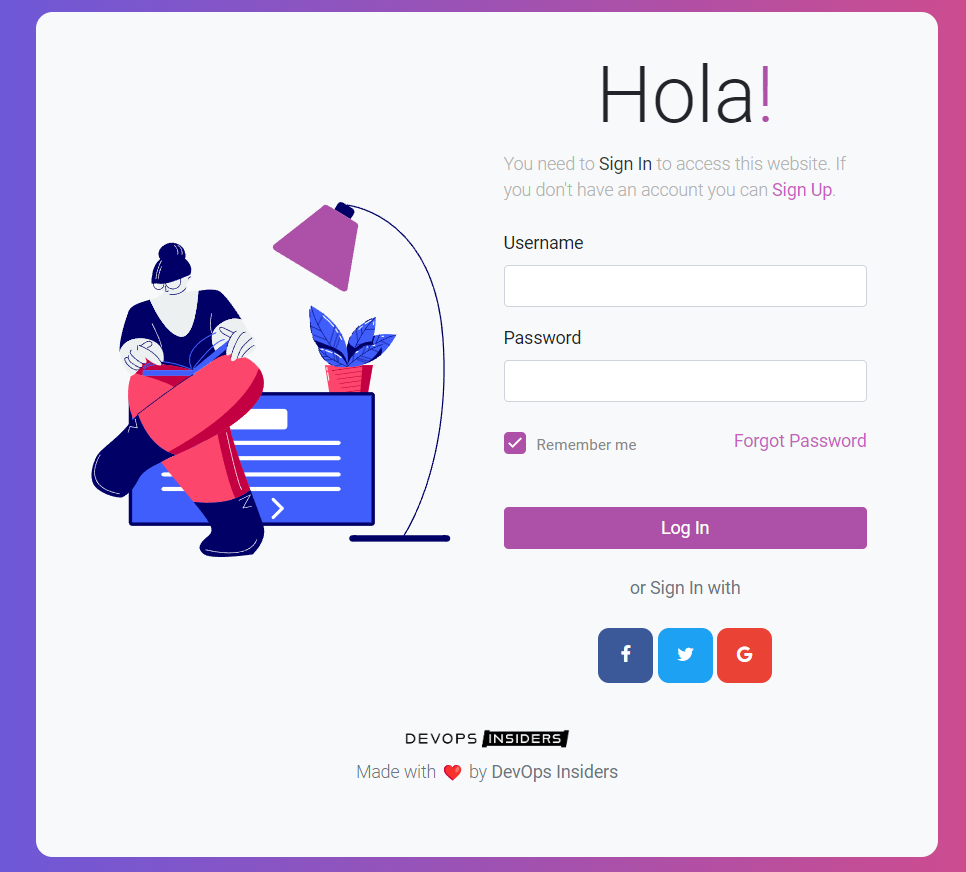

# JavaLoginShowcase 🚀
This repository contains a sample login page implemented in Java for practicing Java deployment techniques. It includes a stylish and functional login UI, designed to help you understand how to deploy and manage a Java-based web application. 💻✨



## Features:
- User-friendly login interface 🖥️
- Responsive design 📱
- Sample code for deploying Java web applications 📦

## Purpose:
This project is a hands-on example for developers looking to practice deploying Java applications. It’s perfect for learning deployment strategies, UI design, and Java web development. 🎓🔧

## Branding:
Made with Love by **DevOps Insiders** ❤️. We are passionate about delivering high-quality solutions and resources for the DevOps community. 🌟

## Prerequisites:
Before you begin, ensure you have met the following requirements:

- **Java Development Kit (JDK)**: Ensure you have JDK 8 or higher installed. You can download it from [Oracle's website](https://www.oracle.com/java/technologies/javase-jdk11-downloads.html) or use OpenJDK. ☕
- **Maven**: Apache Maven is used for building the project. Download and install Maven from [Maven's official website](https://maven.apache.org/download.cgi). 📦
- **Apache Tomcat**: A web server and servlet container for deploying the WAR file. Download it from [Apache Tomcat's website](https://tomcat.apache.org/download-90.cgi). 🖥️
- **Git**: Required for cloning the repository. Install Git from [Git's official website](https://git-scm.com/downloads). 🧩

## Getting Started:
1. **Clone the Repository**:
   ```bash
   git clone https://github.com/your-username/JavaLoginShowcase.git
   ```
2. **Navigate to the Project Directory**:
   ```bash
   cd JavaLoginShowcase
   ```

## Deployment Instructions:
1. **Build the Project**:
   - Use Maven to clean and package the application into a WAR file:
     ```bash
     mvn clean package
     ```
   - This command will generate a WAR file in the `target` directory (e.g., `target/JavaLoginShowcase.war`). 📦

2. **Deploy to Tomcat**:
   - Copy the WAR file to the Tomcat `webapps` directory:
     ```bash
     cp target/JavaLoginShowcase.war $TOMCAT_HOME/webapps/
     ```
   - Restart the Tomcat server to deploy the WAR file:
     ```bash
     $TOMCAT_HOME/bin/shutdown.sh
     $TOMCAT_HOME/bin/startup.sh
     ```

3. **Access the Application**:
   - Once deployed, access the application through your web browser at:
     ```
     http://localhost:8080/JavaLoginShowcase
     ```

## Contributing:
Feel free to contribute by submitting issues or pull requests. We welcome any improvements or suggestions! 🤝

## License:
This project is licensed under the Apache License - see the [LICENSE](LICENSE) file for details. 📜

**DevOps Insiders** is committed to enhancing the DevOps community with valuable resources and examples. Follow us for more tools and insights! 🌟

### Emojis Reference:
- **🚀**: Represents the project being a showcase or launch.
- **💻✨**: Emphasizes the modern and functional nature of the login UI.
- **🖥️** and **📱**: Indicate the types of interfaces and design considerations.
- **🎓🔧**: Suggests learning and hands-on practice.
- **❤️** and **🌟**: Show love and commitment to quality from the DevOps Insiders community.
- **☕**: Represents Java.
- **📦**: Denotes Maven and deployment.
- **🧩**: Indicates Git.
- **🤝**: Encourages contributions.
- **📜**: Represents licensing.

$$$$$$$$$$$$$$$$$$$$$$$$$$$$$$$$$$$$$$$$$$$$$$$$$$$$$$$$$$$$$$$$$$$$$$$$$$$$$$$$$$$$$$$

# 🚀 Java Login App CI/CD Pipeline

This repository demonstrates a complete CI/CD pipeline for a Java web application using Azure DevOps. The pipeline builds the application using Maven, publishes the WAR artifact, and deploys it to an Apache Tomcat server on a Linux VM.

---

## 📌 Overview

The pipeline is divided into two main stages:

1. **Build Stage (CI)** → Compile and package the Java application using Maven  
2. **Deploy Stage (CD)** → Deploy the WAR file to Apache Tomcat  

---

## 📁 Project Structure

```
JavaLoginPracticeApp-surendra/
│
├── src/main/webapp/        # Java web application source
├── pom.xml                 # Maven build configuration
├── azure-pipelines.yml     # CI/CD pipeline definition
├── README.md               # Documentation
└── LICENSE
```

---

## ⚙️ Pipeline Configuration

- **Trigger:** On push to `main` branch  
- **Agent Pool:** Self-hosted (`Default`)  
- **Java Version:** OpenJDK 17  
- **Build Tool:** Maven  

---

## 🧱 Build Stage (CI)

### 🔹 Steps:

1. Install Java 17  
```bash
sudo apt update
sudo apt install -y openjdk-17-jdk
```

2. Set JAVA_HOME  
```bash
export JAVA_HOME=/usr/lib/jvm/java-17-openjdk-amd64
```

3. Build using Maven  
```bash
mvn clean package
```

4. Publish WAR artifact  
- Output folder: `target/`  
- Artifact name: `java-war`  

---

## 🚀 Deploy Stage (CD)

### 🔹 Steps:

1. Download build artifact  
2. Copy WAR file to Tomcat webapps directory  
3. Restart Tomcat server  

---

## 🖥️ Deployment Details

- Tomcat Path:
```
/opt/tomcat
```

- Deployment Location:
```
/opt/tomcat/webapps/JavaLoginShowcase.war
```

---

## 🔐 Tools & Technologies

- Azure DevOps Pipelines  
- Maven  
- Java (OpenJDK 17)  
- Apache Tomcat  
- Linux VM  

---

## 🔄 Deployment Flow

```
Code → Maven Build → WAR → Artifact → Tomcat → Web App Live
```

---

## 🎯 Use Case

- Automating Java application deployment  
- CI/CD implementation using Azure DevOps  
- Deploying WAR file to Tomcat  
- Real-world DevOps pipeline for Java apps  

---

## 💡 Key Learnings

- CI/CD pipeline for Java applications  
- Artifact management in Azure DevOps  
- Deployment to Tomcat server  
- Service restart automation  

---

## 🚀 Future Enhancements

- Add rollback mechanism  
- Add multi-environment deployment (Dev/Prod)  
- Integrate monitoring (Prometheus/Grafana)  
- Use Docker for containerized deployment  

---

🔥 *End-to-end Java application deployment using CI/CD pipeline*
